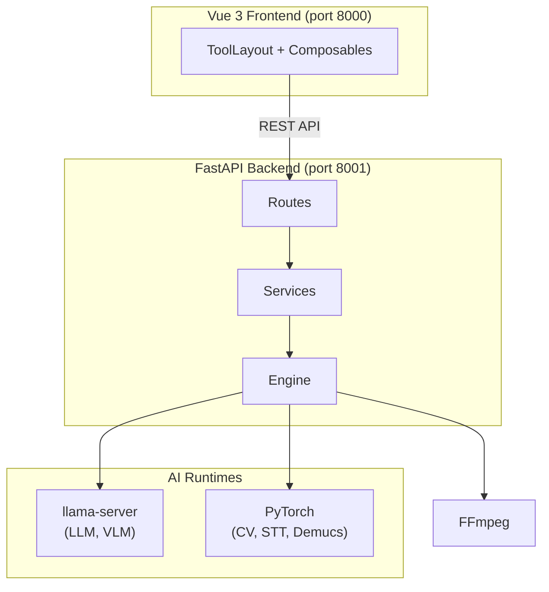

# MediaTranX

[](https://github.com/sw-willie-wu/MediaTranX/releases)
[](LICENSE)
[](https://github.com/sw-willie-wu/MediaTranX/releases)
[](https://github.com/sw-willie-wu/MediaTranX/stargazers)

[](https://www.electronjs.org/)
[](https://vuejs.org/)
[](https://www.python.org/)
[](https://pytorch.org/)

**AI-powered local multimedia processing toolkit** — transcription, translation, upscaling, OCR, and format conversion. All AI inference runs locally on your machine.

[繁體中文](docs/README.zh-TW.md)

[](https://youtu.be/r5vivvL1Nds)

---

## Features

### Image Tools
- Format conversion (PNG, JPEG, WebP, BMP, TIFF, GIF, ICO)
- AI super-resolution (Real-ESRGAN, SwinIR, BSRGAN, Real-CUGAN, Waifu2x)
- AI background removal (rembg)
- AI object removal (MobileSAM + LaMa inpainting)
- Face restoration (CodeFormer, GFPGAN)
- OCR via Vision Language Models
- Adjust, filter, crop

### Audio Tools
- Format transcoding (MP3, WAV, FLAC, OGG, AAC, M4A, WMA, OPUS)
- Cut, volume adjustment
- AI transcription (Faster-Whisper) with summarization
- AI source separation (Demucs 6-stem)
- AI lyrics extraction with forced alignment
- MIDI export (Basic Pitch + FluidSynth)
- Translation via local LLM or cloud API

### Video Tools
- Format transcoding (MP4, MKV, AVI, MOV, WebM, etc.)
- Cut with stream copy, audio extraction
- AI subtitle generation (Whisper)
- AI subtitle translation
- AI frame interpolation (RIFE)
- AI super-resolution (Real-ESRGAN)

### Document Tools
- OCR via Vision Language Models
- AI translation
- PDF split, PDF conversion

### General
- Multi-file batch processing with filmstrip UI
- Dark / light theme with glassmorphism design
- Real-time task progress tracking
- Local + cloud AI model support (Ollama, OpenAI, Gemini)
- i18n: English, Traditional Chinese

---

## AI Models

| Category | Models |
|----------|--------|
| **Speech-to-Text** | Faster-Whisper (tiny / base / small / medium / large-v3) |
| **Translation LLM** | TranslateGemma (4B/12B/27B), Qwen3 (1.7B/4B/8B/14B) |
| **Super-Resolution** | Real-ESRGAN, SwinIR, BSRGAN, Real-CUGAN, Waifu2x |
| **Face Restoration** | CodeFormer, GFPGAN v1.4 |
| **VLM (OCR)** | Qwen3-VL (2B/4B/8B), InternVL2.5 (1B/4B), Gemma 3 (4B/12B) |
| **Source Separation** | Demucs HTDemucs 6-stem |
| **Forced Alignment** | Wav2Vec2 (16 languages) |
| **Frame Interpolation** | RIFE v4.22 / v4.25 |
| **Object Segmentation** | MobileSAM |

Models are downloaded on-demand through the built-in model manager.

---

## Tech Stack

```
Frontend:  Vue 3 + TypeScript + Pinia + Vite
Backend:   FastAPI + Python 3.12 + uv
AI:        PyTorch / CTranslate2 / llama-server
Media:     FFmpeg / FluidSynth
```

---

## Architecture



See [docs/ARCHITECTURE.md](docs/ARCHITECTURE.md) for details.

---

## Getting Started

### Prerequisites

- **Node.js** 18+
- **Python** 3.12 (managed via [uv](https://docs.astral.sh/uv/))
- **NVIDIA GPU** + CUDA recommended (6GB+ VRAM), CPU mode also supported

### Setup

```bash
git clone https://github.com/sw-willie-wu/MediaTranX.git
cd MediaTranX

# Backend
cd backend
uv sync

# Download binary tools (FFmpeg, FluidSynth, llama-server) into bin/

# Frontend
cd ../frontend
npm install
```

### Run

```bash
# Terminal 1: Backend (port 8001)
cd backend
uv run python -m app.main --mode dev --port 8001

# Terminal 2: Frontend (port 8000)
cd frontend
npm run dev
```

Open `http://localhost:8000` in your browser.

### Environment Variables

The backend is configured via environment variables (pydantic-settings, prefix `MEDIATRANX_`):

| Variable | Description | Default (dev) |
|----------|-------------|---------------|
| `MEDIATRANX_PATH__DATA` | Data root directory | `.` (cwd) |
| `MEDIATRANX_PATH__VENV` | Python venv path | `.venv` |
| `MEDIATRANX_PATH__BIN` | Binary tools directory | `bin` |
| `MEDIATRANX_PATH__MODELS` | AI models directory | `models` |
| `MEDIATRANX_DB__DSN` | Database connection string | `sqlite:///mediatranx.db` |
| `MEDIATRANX_SERVER__MODE` | `production` or `dev` | `production` |

These can also be set in a `.env` file in the backend directory.

### Download AI Models

After launch, download models from **Settings > AI Models**.

---

## Documentation

- [Architecture](docs/ARCHITECTURE.md) — System overview, API endpoints, data flow
- [Backend Development Spec](docs/BACKEND_DEVELOP_SPEC.md) — Backend development guidelines
- [Frontend Development Spec](docs/FRONTEND_DEVELOP_SPEC.md) — UI/UX specifications

---

## License

MIT — see [LICENSE](LICENSE) for details.
