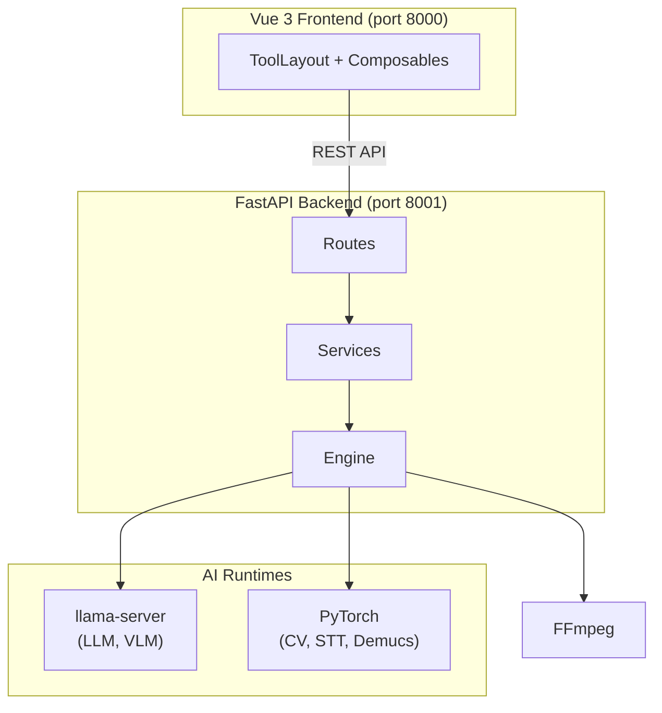

# MediaTranX — AI-Powered Local Multimedia Toolkit

[](https://github.com/sw-willie-wu/MediaTranX/releases)
[](LICENSE)
[](https://github.com/sw-willie-wu/MediaTranX/releases)
[](https://github.com/sw-willie-wu/MediaTranX/stargazers)

[](https://www.electronjs.org/)
[](https://vuejs.org/)
[](https://www.python.org/)
[](https://pytorch.org/)

Free, open-source desktop app for **AI speech-to-text, AI translation, AI image upscaling, AI OCR, audio source separation, and media transcoding** — all running locally on your machine. No cloud, no subscription, full privacy.

[繁體中文](docs/README.zh-TW.md)

[](https://youtu.be/r5vivvL1Nds)

---

## Key Features

### Image Processing
- **AI Super-Resolution** — upscale images 2x-4x with Real-ESRGAN, SwinIR, BSRGAN, Real-CUGAN, Waifu2x
- **AI Background Removal** — automatic background removal using rembg
- **AI Object Removal** — select and remove objects with MobileSAM + LaMa inpainting
- **AI Face Restoration** — repair faces with CodeFormer and GFPGAN
- **AI OCR** — extract text from images using Vision Language Models (Qwen3-VL, InternVL, Gemma 3)
- **Format Conversion** — PNG, JPEG, WebP, BMP, TIFF, GIF, ICO
- **Image Editing** — adjust, filter, crop

### Audio Processing
- **AI Speech-to-Text** — transcribe audio with Faster-Whisper (tiny to large-v3) + auto-summarization
- **AI Source Separation** — isolate vocals, drums, bass, guitar, piano, other with Demucs 6-stem
- **AI Lyrics Extraction** — extract and align lyrics with Wav2Vec2 forced alignment (16 languages)
- **AI Translation** — translate transcriptions via local LLM (Qwen3, TranslateGemma) or cloud API (OpenAI, Gemini)
- **MIDI Editor** — piano roll editor with Tone.js playback, GM soundfont, effects, and audio export
- **Format Transcoding** — MP3, WAV, FLAC, OGG, AAC, M4A, WMA, OPUS
- **Audio Editing** — cut, volume adjustment

### Video Processing
- **AI Subtitle Generation** — extract subtitles from video with Whisper speech recognition
- **AI Subtitle Translation** — translate subtitles with local LLM or cloud API
- **AI Frame Interpolation** — increase video FPS with RIFE (2x/4x/custom)
- **AI Video Enhancement** — upscale video resolution with Real-ESRGAN
- **Format Transcoding** — MP4, MKV, AVI, MOV, WebM with codec control (H.264/H.265/VP9/AV1)
- **Video Editing** — cut with stream copy, audio extraction

### Document Processing
- **AI OCR** — extract text from documents and PDFs using Vision Language Models
- **AI Translation** — translate documents with local LLM or cloud API
- **PDF Tools** — split, convert

### General
- **Multi-file batch processing** with filmstrip management UI
- **Dark / light theme** with glassmorphism design
- **Real-time task progress** tracking
- **Local + cloud AI** model support (Ollama, OpenAI, Gemini)
- **Multilingual UI** — English, Traditional Chinese
- **100% local inference** — no data leaves your machine

---

## Supported AI Models

| Category | Models |
|----------|--------|
| **Speech-to-Text** | Faster-Whisper (tiny / base / small / medium / large-v3) |
| **Translation LLM** | TranslateGemma (4B/12B/27B), Qwen3 (1.7B/4B/8B/14B) |
| **Image Super-Resolution** | Real-ESRGAN, SwinIR, BSRGAN, Real-CUGAN, Waifu2x |
| **Face Restoration** | CodeFormer, GFPGAN v1.4 |
| **Vision LLM (OCR)** | Qwen3-VL (2B/4B/8B), InternVL2.5 (1B/4B), Gemma 3 (4B/12B) |
| **Source Separation** | Demucs HTDemucs 6-stem |
| **Forced Alignment** | Wav2Vec2 (16 languages) |
| **Frame Interpolation** | RIFE v4.26 |
| **Object Segmentation** | MobileSAM |

All models are downloaded on-demand through the built-in model manager. No manual setup required.

---

## Tech Stack

| Layer | Technology |
|-------|------------|
| Desktop Shell | Electron 34 |
| Frontend | Vue 3 + TypeScript + Pinia + Vite |
| Backend | FastAPI + Python 3.12 + uv |
| AI Inference | PyTorch, CTranslate2, llama-server (GGUF) |
| Media | FFmpeg, Tone.js |

---

## Architecture



See [docs/ARCHITECTURE.md](docs/ARCHITECTURE.md) for details.

---

## Getting Started

### Prerequisites

- **Node.js** 18+
- **Python** 3.12 (managed via [uv](https://docs.astral.sh/uv/))
- **NVIDIA GPU** + CUDA recommended (6GB+ VRAM), CPU mode also supported

### Install

```bash
git clone https://github.com/sw-willie-wu/MediaTranX.git
cd MediaTranX

# Backend
cd backend
uv sync

# Frontend
cd ../frontend
npm install
```

### Run

```bash
# Terminal 1: Backend (port 8001)
cd backend
uv run python -m app.main --mode dev --port 8001

# Terminal 2: Frontend (port 8000)
cd frontend
npm run dev
```

Open `http://localhost:8000` in your browser.

### Download AI Models

After launch, go to **Settings > AI Models** to download the models you need.

---

## Documentation

- [Architecture](docs/ARCHITECTURE.md) — System overview, API endpoints, data flow
- [Backend Development Spec](docs/BACKEND_DEVELOP_SPEC.md) — Backend development guidelines
- [Frontend Development Spec](docs/FRONTEND_DEVELOP_SPEC.md) — UI/UX specifications

---

## License

MIT — see [LICENSE](LICENSE) for details.
