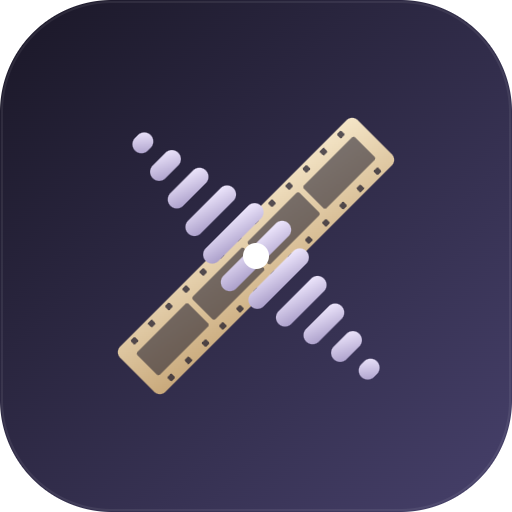
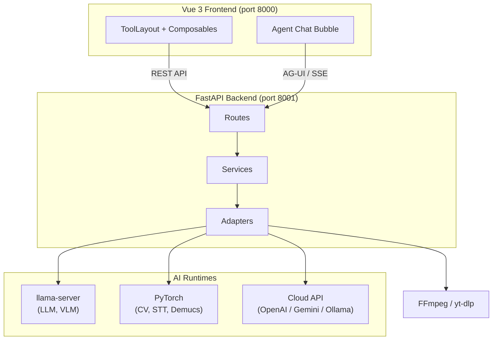

<p align="center">
  
</p>

<h1 align="center">MediaTranX — AI-Powered Local Multimedia Toolkit</h1>

<p align="center">
<a href="https://github.com/sw-willie-wu/MediaTranX/releases"></a>
<a href="LICENSE"></a>
<a href="https://github.com/sw-willie-wu/MediaTranX/releases"></a>
<a href="https://github.com/sw-willie-wu/MediaTranX/stargazers"></a>
</p>

<p align="center">
<a href="https://www.electronjs.org/"></a>
<a href="https://vuejs.org/"></a>
<a href="https://www.python.org/"></a>
<a href="https://pytorch.org/"></a>
</p>

Free, open-source desktop app for **AI speech-to-text, AI translation, AI image upscaling, AI OCR, audio source separation, video summarization, and media transcoding** — driven by natural language or a classic tool UI, all running **locally** on your machine. No cloud required, no subscription, full privacy. Cloud providers (OpenAI / Gemini / Ollama) are optional.

[繁體中文](docs/README.zh-TW.md)

[](https://youtu.be/r5vivvL1Nds)

---

## Key Features

### 🤖 AI Assistant (Natural Language)
- **Chat-driven workflow** — describe a task in plain language ("turn this into a 1080p MP4", "transcribe and translate to English") and the built-in agent drives the tools for you: it navigates to the right tool, picks the function, loads files, fills in settings, and runs the task — with a confirmation step before anything executes.
- **Works across every domain** — Image, Audio, Video, and Document tools.
- **Local or cloud** — runs on a local LLM (Qwen3, Gemma) or a cloud model (OpenAI, Gemini, Ollama).
- **Multi-session history** — conversations are saved and resumable.

### 🖼️ Image Processing
- **AI Super-Resolution** — upscale images 2x–4x with Real-ESRGAN, SwinIR, BSRGAN, Real-CUGAN, Waifu2x — with optional **face restoration (GFPGAN)**.
- **AI Background Removal** — automatic background removal with rembg (U²-Net / ISNet), with auto / person / product / animal / anime modes.
- **AI Object Removal** — brush, polygon, or bezier select an object and erase it with MobileSAM segmentation + LaMa inpainting.
- **AI OCR** — extract text from images using Vision Language Models (Qwen3-VL, InternVL2.5, Gemma) — locally or via cloud.
- **Format Conversion** — PNG, JPEG, WebP, BMP, TIFF, GIF, ICO.
- **Image Editing** — adjust (brightness/contrast/saturation/hue/sharpness), filters, crop — with real-time preview.

### 🎵 Audio Processing
- **AI Speech-to-Text** — transcribe audio with Faster-Whisper (tiny → large-v3), with optional vocal separation, translation, and word-level alignment.
- **AI Source Separation** — isolate vocals, drums, bass, guitar, piano, and other with Demucs 6-stem — with optional **audio → MIDI** conversion (Basic Pitch).
- **AI Lyrics Extraction** — recognize and align lyrics with Wav2Vec2 forced alignment (multilingual).
- **AI Translation** — translate transcriptions / lyrics via local LLM (Qwen3, Gemma) or cloud API (OpenAI, Gemini, Ollama).
- **MIDI Editor** — full piano-roll editor with Tone.js playback, GM soundfonts, per-note velocity, tempo / time-signature, effects, and audio export.
- **Format Transcoding** — MP3, AAC, OGG, M4A, Opus, FLAC, ALAC, WAV, AIFF.
- **Audio Editing** — cut, volume adjustment.

### 🎬 Video Processing
- **AI Subtitle Generation** — extract subtitles from video with Whisper, with optional translation and word-level alignment.
- **AI Video Summary** — generate a Markdown summary with representative key frames (bullet-point or narrative mode). Combines Whisper transcription, LLM summarization, scene detection, and optional **VLM frame selection**; exports a ZIP (summary + key frames).
- **Download by URL** — paste a video link and download it via yt-dlp (auto-best / capped resolution / pick-a-format), then jump straight into editing.
- **AI Frame Interpolation** — increase video FPS with RIFE (2x / 4x / custom).
- **AI Video Enhancement** — upscale video resolution with Real-ESRGAN / SwinIR.
- **Format Transcoding** — MP4, MKV, AVI, MOV, WebM with codec control (H.264 / H.265 / VP9).
- **Video Editing** — cut with stream copy, crop, audio extraction.

### 📄 Document Processing
- **AI OCR** — extract text from documents and PDFs using Vision Language Models — locally or via cloud.
- **AI Translation** — translate documents with local LLM or cloud API.
- **PDF Tools** — split by pages, convert to text / Markdown / page images.

### ⚙️ General
- **Multi-file batch processing** with a filmstrip management UI (apply one operation to many files).
- **Results drawer** — browse all task outputs from the title bar and open any result directly in the relevant tool.
- **Paste to add files** — `Ctrl+V` an image or file from the clipboard or Explorer.
- **Before / after comparison slider** for image and video results.
- **Dark / light theme** with a glassmorphism design.
- **Real-time task progress** tracking, with cancel support.
- **Local + cloud AI** model support — local inference by default; OpenAI / Gemini / Ollama connections are optional and managed in Settings.
- **Multilingual UI** — English, Traditional Chinese.
- **100% local inference by default** — no data leaves your machine unless you choose a cloud model.

---

## Supported AI Models

| Category | Models |
|----------|--------|
| **Speech-to-Text** | Faster-Whisper (tiny / base / small / medium / large-v3) |
| **Chat / Translation / Summary LLM** | Qwen3, Qwen3.5, Gemma 3, Gemma 4 (multiple sizes) — local GGUF or cloud |
| **Vision LLM (OCR / frame selection)** | Qwen3-VL, InternVL2.5, Gemma (multiple sizes) — local GGUF or cloud |
| **Image Super-Resolution** | Real-ESRGAN, SwinIR, BSRGAN, Real-CUGAN, Waifu2x |
| **Face Restoration** | GFPGAN v1.4 |
| **Object Removal** | MobileSAM (segmentation) + LaMa (inpainting) |
| **Background Removal** | rembg — U²-Net / ISNet |
| **Source Separation** | Demucs HTDemucs 6-stem |
| **Audio → MIDI** | Basic Pitch |
| **Forced Alignment** | Wav2Vec2 (multilingual) |
| **Frame Interpolation** | RIFE v4.26 |
| **Cloud Providers** | OpenAI, Google Gemini, Ollama (optional) |

All local models are downloaded on-demand through the built-in model manager. No manual setup required.

---

## Tech Stack

| Layer | Technology |
|-------|------------|
| Desktop Shell | Electron 35 |
| Frontend | Vue 3 + TypeScript + Pinia + Vite |
| Backend | FastAPI + Python 3.12 + uv |
| AI Inference | PyTorch, CTranslate2, llama-server (GGUF) |
| Agent Protocol | AG-UI (streaming tool-calling over SSE) |
| Media | FFmpeg, yt-dlp, Tone.js |

---

## Architecture



See [docs/ARCHITECTURE.md](docs/ARCHITECTURE.md) for details.

---

## Getting Started

> Most users should just grab the installer from the [Releases](https://github.com/sw-willie-wu/MediaTranX/releases) page. The instructions below are for running from source.

### Prerequisites

- **Node.js** 18+
- **Python** 3.12 (managed via [uv](https://docs.astral.sh/uv/))
- **NVIDIA GPU** + CUDA recommended (6GB+ VRAM), CPU mode also supported

### Install

```bash
git clone https://github.com/sw-willie-wu/MediaTranX.git
cd MediaTranX

# Backend
cd backend
uv sync

# Frontend
cd ../frontend
npm install
```

### Run

```bash
# Terminal 1: Backend (port 8001)
cd backend
uv run python -m app.main --mode dev --port 8001

# Terminal 2: Frontend (port 8000)
cd frontend
npm run dev
```

Open `http://localhost:5173` in your browser (Vite's default dev port; the Electron shell injects `VITE_PORT=8000` at runtime, hence port 8000 in the architecture diagram).

> Prefer containers? `docker compose up` runs the backend + frontend without Electron
> (see `docker-compose.yml`; for CPU-only hosts add the CPU override:
> `docker compose -f docker-compose.yml -f docker-compose.cpu.yml up`).

### Desktop App (Electron)

The Electron shell wraps the backend + frontend into a desktop app.

```bash
# Dev (launches Electron, which spawns the backend + Vite dev server)
cd electron
npm install
npm run electron

# Build a Windows installer (dev build, auto-restores version)
uv run --project backend python scripts/build.py --mode dev
# -> dist/MediaTranX-Setup-X.Y.Z-dev.N-win.exe
```

See [docs/BUILD_STRATEGY.md](docs/BUILD_STRATEGY.md) and [docs/RELEASE.md](docs/RELEASE.md) for the full build/release flow.

### Download AI Models

After launch, go to **Settings > AI Models** to download the models you need. To use cloud providers, add a connection (API key / endpoint) under the same screen.

---

## Documentation

- [Architecture](docs/ARCHITECTURE.md) — System overview, API endpoints, data flow
- [Backend Development Spec](docs/BACKEND_DEVELOP_SPEC.md) — Backend development guidelines
- [Frontend Development Spec](docs/FRONTEND_DEVELOP_SPEC.md) — UI/UX specifications

---

## License

MIT — see [LICENSE](LICENSE) for details.
