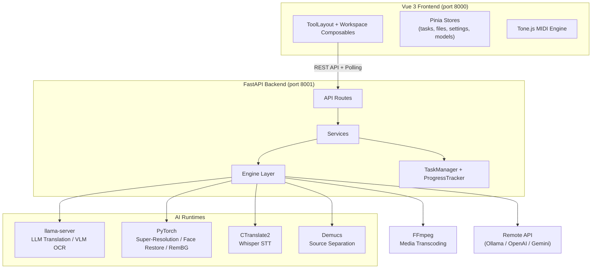
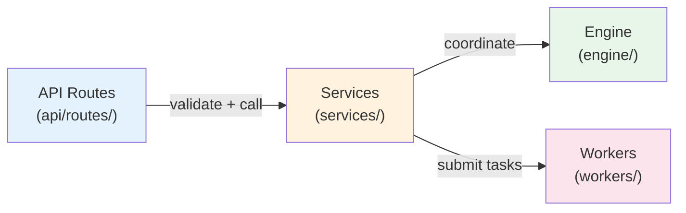
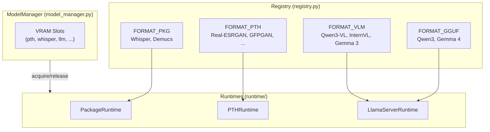
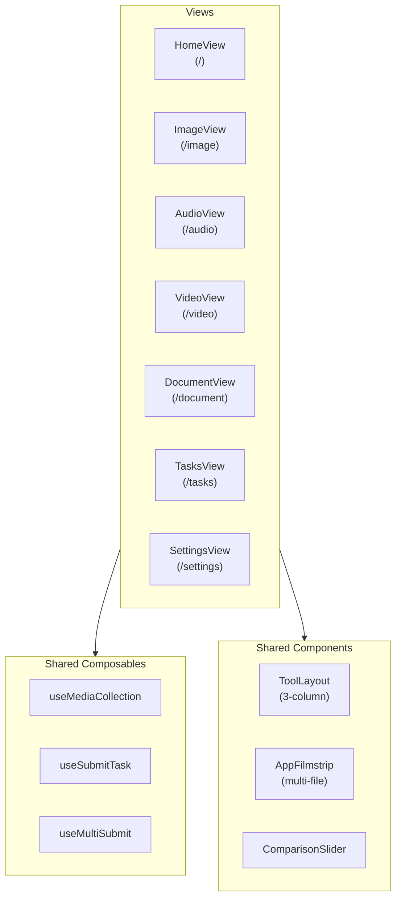
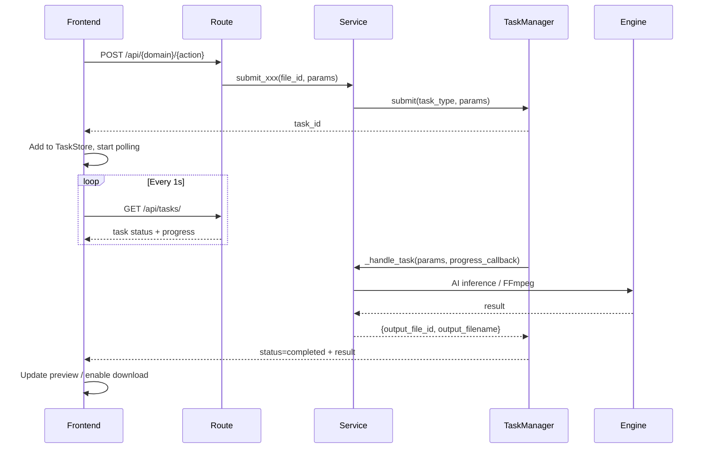

# MediaTranX Architecture

> **AI-powered local multimedia processing platform** — speech recognition, translation, image processing, OCR, and media transcoding. All AI inference runs on the user's machine.

---

## 1. System Architecture

MediaTranX Core uses a **Client-Server** architecture — Vue 3 frontend + FastAPI backend:



---

## 2. Backend Three-Layer Architecture



**Rules:** Route → Service → Engine. No cross-layer jumps.

```
backend/app/
├── main.py                          # FastAPI entry point
├── init/                            # Startup (DLL injection, logging, DI container)
│   ├── container.py                 # DI container with _lazy() domain services
│   └── lifespan.py                  # Startup/shutdown + background warmup thread
├── api/routes/                      # Route layer (TYPE_CHECKING service imports)
│   ├── audio/                       # transcode, cut, volume, transcribe, separate, lyrics, midi
│   ├── video/                       # transcode, cut, extract-audio, subtitle, interpolate, enhance
│   ├── image/                       # convert, upscale, remove-bg, remove-object, filter, crop, ocr
│   ├── document/                    # ocr, translate, split, pdf-convert
│   ├── setup/                       # status, config, models, remote
│   ├── llm.py                       # LLM shared queries (translate languages/styles/status)
│   └── tasks/                       # active, history
├── services/                        # Business layer (one service per task type)
│   ├── audio/                       # cut, lyrics, separate, transcode, transcribe, volume, midi
│   ├── video/                       # transcode, cut, extract_audio, subtitle, interpolate, enhance
│   ├── image/                       # convert, crop, filter, ocr, remove_bg, remove_object, upscale
│   ├── document/                    # doc_ocr, pdf_convert, split, translate
│   ├── files/                       # file_service (upload, temp storage)
│   ├── setup/                       # config, device, model_download, remote, ...
│   └── tasks/                       # history_service
├── engine/                          # Low-level wrappers
│   ├── device.py                    # GPU/CPU detection
│   ├── ffmpeg.py                    # FFmpegWrapper (async + sync methods)
│   └── ai/                          # AI models
│       ├── registry.py              # Model registry (FORMAT × family × variant + inference config)
│       ├── model_manager.py         # VRAM slot scheduling
│       ├── runtime/                 # BaseRuntime, PackageRuntime, PTHRuntime, LlamaServerRuntime
│       ├── audio/                   # whisper, demucs, wav2vec2, basic_pitch
│       ├── image/                   # realesrgan, swinir, bsrgan, real_cugan, waifu2x, codeformer, gfpgan, mobilesam
│       ├── video/                   # rife
│       ├── remote/                  # ollama, openai, gemini
│       └── llama/                   # LLM prompt templates
├── workers/                         # TaskManager + ProgressTracker
├── db/                              # SQLModel (api_connection, task_history)
├── types/                           # Cross-layer domain types (TaskData, FileData)
└── utils/                           # inference, prompts, translate, summarize, video_frames, gif_utils
```

Development specs: [BACKEND_DEVELOP_SPEC.md](BACKEND_DEVELOP_SPEC.md)

### AI Model System



### Remote API Providers

Support cloud models as alternatives to local models:

| Provider | Use |
|----------|-----|
| Ollama | Self-hosted LLM server |
| OpenAI | GPT translation / OCR |
| Gemini | Google AI translation / OCR |

---

## 3. Frontend Architecture



### Pinia Stores

| Store | Description |
|-------|-------------|
| `tasks` | Task state (`Map<taskId, Task>`) + polling sync |
| `files` | File upload / local registration |
| `settings` | User preferences (theme, locale, paths) |
| `models` | Local AI model state |
| `remoteModels` | Cloud API model lists |

### Shared Framework

- **ToolLayout**: 3-column layout (sidebar + preview + settings), resizable
- **AppFilmstrip**: Multi-file management bar, Shift+drag selection, Ctrl+click
- **useMediaCollection**: Multi-file state composable, shared across all tools
- **useSubmitTask**: Task submission (POST → store → toast)
- **ComparisonSlider**: Before/after image comparison slider

Development specs: [FRONTEND_DEVELOP_SPEC.md](FRONTEND_DEVELOP_SPEC.md)

---

## 4. Task Lifecycle



---

## 5. Data Paths

All paths managed via `PathSettings` (pydantic-settings):

| Directory | Default (dev) | Production |
|-----------|---------------|------------|
| Models | `backend/models/` | `%APPDATA%/MediaTranX/models/` |
| Venv | `backend/.venv/` | `%APPDATA%/MediaTranX/.venv/` |
| Bin | `backend/bin/` | `%LOCALAPPDATA%/MediaTranX/resources/bin/` |
| Temp | `backend/data/temp/` | `%APPDATA%/MediaTranX/temp/` |
| Logs | stdout | `%APPDATA%/MediaTranX/logs/` |
| DB | `backend/mediatranx.db` | `%APPDATA%/MediaTranX/mediatranx.db` |

---

## 6. API Endpoints

| Method | Endpoint | Description |
|--------|----------|-------------|
| **System & Setup** | | |
| GET | `/api/health` | Health check |
| GET | `/api/device` | GPU/CPU device info |
| GET | `/api/setup/status` | AI environment status |
| POST | `/api/setup/initialize` | Start AI environment installation |
| GET/POST | `/api/setup/config` | App configuration |
| GET | `/api/setup/models` | Model list |
| POST | `/api/setup/models/download` | Download model |
| POST | `/api/setup/models/remove` | Remove model |
| GET/POST | `/api/setup/remote/connections` | Cloud API connection management |
| GET | `/api/setup/remote/models` | Cloud model list |
| **Files** | | |
| POST | `/api/files/upload` | Upload file |
| POST | `/api/files/register` | Register local file (Electron) |
| GET | `/api/files/{id}/download` | Download file |
| POST | `/api/files/cleanup` | Cleanup temp files |
| **Tasks** | | |
| GET | `/api/tasks/` | Active tasks |
| GET | `/api/tasks/{id}/progress` | Task progress |
| POST | `/api/tasks/{id}/cancel` | Cancel task |
| GET | `/api/tasks/history` | Task history |
| **Video** | | |
| GET | `/api/video/info/{file_id}` | Media info |
| POST | `/api/video/transcode` | Transcode |
| POST | `/api/video/cut` | Cut |
| POST | `/api/video/extract-audio` | Extract audio track |
| POST | `/api/video/subtitle/generate` | Subtitle extraction (Whisper) |
| POST | `/api/video/interpolate` | Frame interpolation (RIFE) |
| POST | `/api/video/enhance` | Video enhancement (Real-ESRGAN) |
| POST | `/api/video/crop` | Crop video frame (spatial) |
| **Audio** | | |
| GET | `/api/audio/info/{file_id}` | Audio info |
| POST | `/api/audio/transcode` | Transcode |
| POST | `/api/audio/cut` | Cut |
| POST | `/api/audio/volume` | Volume adjust |
| POST | `/api/audio/transcribe` | Speech-to-text |
| POST | `/api/audio/separate` | Source separation (Demucs) |
| POST | `/api/audio/lyrics` | Lyrics extraction |
| GET/POST | `/api/audio/midi/*` | MIDI editing & export |
| **Image** | | |
| GET | `/api/image/info/{file_id}` | Image info |
| POST | `/api/image/convert` | Format conversion |
| POST | `/api/image/upscale` | Super-resolution |
| POST | `/api/image/remove-bg` | Background removal |
| POST | `/api/image/remove-object` | Object removal (SAM + LaMa) |
| POST | `/api/image/filter` | Filters |
| POST | `/api/image/crop` | Crop |
| POST | `/api/image/ocr` | OCR (VLM) |
| **Document** | | |
| POST | `/api/document/ocr` | OCR (VLM) |
| POST | `/api/document/translate` | Translation |
| POST | `/api/document/split` | Split |
| POST | `/api/document/pdf-convert` | PDF conversion |

---

## 7. Development

### Requirements

- Node.js 18+
- Python 3.12 (managed via [uv](https://docs.astral.sh/uv/))
- NVIDIA GPU + CUDA (recommended 6GB+ VRAM), CPU also supported

### Start

```bash
# Frontend (port 8000)
cd frontend && npm install && npm run dev

# Backend (port 8001)
cd backend && uv sync && uv run python -m app.main --mode dev --port 8001
```

### AI Models

After launch, download models from **Settings > AI Models**.
