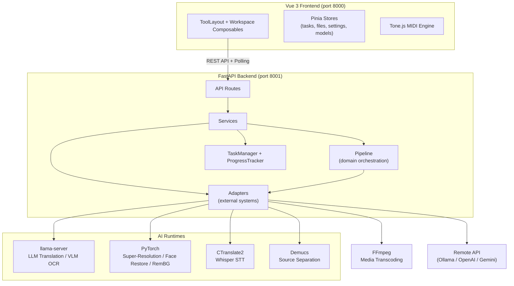
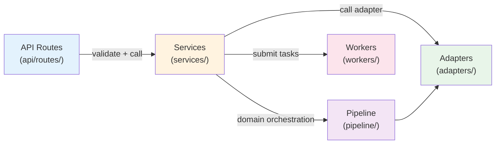
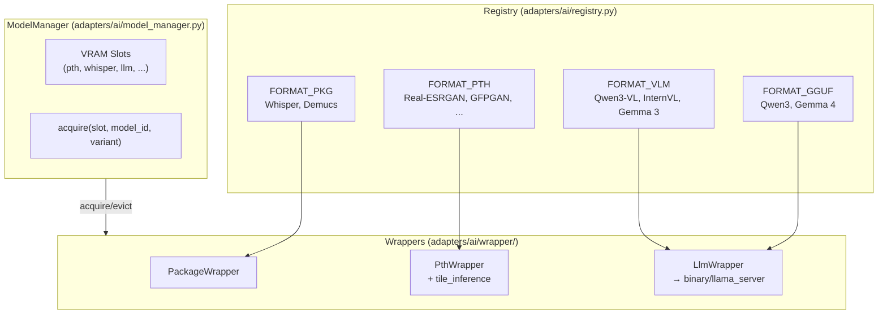
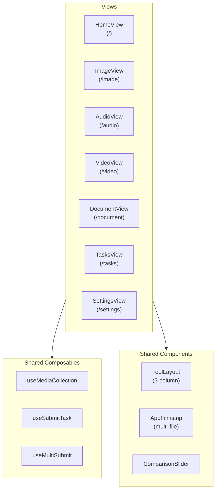

# MediaTranX Architecture

> **AI-powered local multimedia processing platform** — speech recognition, translation, image processing, OCR, and media transcoding. All AI inference runs on the user's machine.

---

## 1. System Architecture

MediaTranX Core uses a **Client-Server** architecture — Vue 3 frontend + FastAPI backend:



---

## 2. Backend Layered Architecture



**Rules:** Route → Service → (Pipeline) → Adapter. No cross-layer jumps.

```
backend/app/
├── main.py                          # FastAPI entry point
├── init/                            # Startup (DI container, configs, lifespan)
│   ├── container.py                 # DI container with _lazy() domain services
│   └── lifespan.py                  # Startup/shutdown + background warmup thread
├── api/routes/                      # Route layer (TYPE_CHECKING service imports)
│   ├── audio/, image/, video/, document/     # per-feature route files + inline DTO
│   ├── files/, llm/, health/                 # concern folders
│   ├── setup/, tasks/
├── adapters/                        # External-system adapters (需跨層協調)
│   ├── device.py                    # GPU/CPU detection
│   ├── binary/                      # Binary subprocess wrappers
│   │   ├── ffmpeg.py
│   │   └── llama_server.py
│   └── ai/                          # AI domain adapters
│       ├── model_manager.py         # VRAM slot + acquire coordinator
│       ├── registry.py              # Static model metadata
│       ├── tile_inference.py        # PTH tensor tile/stitch helper
│       ├── remote/                  # HTTP provider adapters (openai/gemini/ollama)
│       └── wrapper/                 # AI model lifecycle wrapper family
│           ├── base.py              # BaseWrapper / PackageWrapper / PthWrapper
│           ├── whisper.py, demucs.py, basic_pitch.py, wav2vec2.py
│           ├── bsrgan.py, realesrgan.py, swinir.py, waifu2x.py, real_cugan.py
│           ├── codeformer.py, gfpgan.py
│           ├── mobilesam.py, rife.py
│           └── llm.py               # LlmWrapper (wraps binary/llama_server)
├── services/                        # Business layer (service = cohesive business logic)
│   ├── audio/, image/, video/, document/     # modality feature services
│   ├── files/, llm/, setup/, tasks/          # cross-cutting services
├── pipeline/                        # Cross-service domain orchestration
│   └── translate.py, transcribe.py, ocr.py
├── utils/                           # Pure technical helpers (技術中性 + 2+ consumer)
├── workers/                         # TaskManager + ProgressTracker + media_kind
├── handler/                         # HTTP cross-cutting (exceptions + responses + middleware)
├── schemas/                         # Cross-layer domain types (TaskData, FileData)
├── db/                              # SQLModel (api_connection, task_history)
└── main.py
```

Development specs: [BACKEND_DEVELOP_SPEC.md](BACKEND_DEVELOP_SPEC.md)

### AI Model System



### Remote API Providers

Support cloud models as alternatives to local models:

| Provider | Use |
|----------|-----|
| Ollama | Self-hosted LLM server |
| OpenAI | GPT translation / OCR |
| Gemini | Google AI translation / OCR |

---

## 3. Frontend Architecture



### Pinia Stores

| Store | Description |
|-------|-------------|
| `tasks` | Task state (`Map<taskId, Task>`) + polling sync |
| `files` | File upload / local registration |
| `settings` | User preferences (theme, locale, paths) |
| `models` | Local AI model state |
| `remoteModels` | Cloud API model lists |

### Shared Framework

- **ToolLayout**: 3-column layout (sidebar + preview + settings), resizable
- **AppFilmstrip**: Multi-file management bar, Shift+drag selection, Ctrl+click
- **useMediaCollection**: Multi-file state composable, shared across all tools
- **useSubmitTask**: Task submission (POST → store → toast)
- **ComparisonSlider**: Before/after image comparison slider

Development specs: [FRONTEND_DEVELOP_SPEC.md](FRONTEND_DEVELOP_SPEC.md)

---

## 4. Task Lifecycle


---

## 5. Data Paths

All paths managed via `PathSettings` (pydantic-settings):

| Directory | Default (dev) | Production |
|-----------|---------------|------------|
| Models | `backend/models/` | `%APPDATA%/MediaTranX/models/` |
| Venv | `backend/.venv/` | `%APPDATA%/MediaTranX/.venv/` |
| Bin | `backend/bin/` | `%LOCALAPPDATA%/MediaTranX/resources/bin/` |
| Temp | `backend/data/temp/` | `%APPDATA%/MediaTranX/temp/` |
| Logs | stdout | `%APPDATA%/MediaTranX/logs/` |
| DB | `backend/mediatranx.db` | `%APPDATA%/MediaTranX/mediatranx.db` |

---

## 6. API Endpoints

| Method | Endpoint | Description |
|--------|----------|-------------|
| **System & Setup** | | |
| GET | `/api/health` | Health check |
| GET | `/api/health/deep` | Deep health check |
| GET | `/api/device` | GPU/CPU device info |
| POST | `/api/device/refresh` | Refresh device state |
| GET | `/api/setup/status` | AI environment status |
| POST | `/api/setup/initialize` | Start AI environment installation |
| GET/POST | `/api/setup/config` | App configuration |
| GET | `/api/setup/models` | Model list |
| POST | `/api/setup/models/download` | Download model |
| POST | `/api/setup/models/remove` | Remove model |
| GET/POST | `/api/setup/remote/connections` | Cloud API connection management |
| GET | `/api/setup/remote/models` | Cloud model list |
| **Files** | | |
| POST | `/api/files/upload` | Upload file |
| POST | `/api/files/register` | Register local file (Electron) |
| GET | `/api/files/{id}/download` | Download file |
| POST | `/api/files/cleanup` | Cleanup temp files |
| **Tasks** | | |
| GET | `/api/tasks/` | Active tasks |
| GET | `/api/tasks/{id}/progress` | Task progress |
| POST | `/api/tasks/{id}/cancel` | Cancel task |
| GET | `/api/tasks/history` | Task history |
| **LLM** | | |
| GET | `/api/llm/translate/languages` | Supported translation languages |
| GET | `/api/llm/translate/styles` | Supported translation styles |
| GET | `/api/llm/translate/status` | Translation model status |
| POST | `/api/llm/chat` | Direct LLM chat (test) |
| **Video** | | |
| GET | `/api/video/info/{file_id}` | Media info |
| POST | `/api/video/transcode` | Transcode |
| POST | `/api/video/cut` | Cut |
| POST | `/api/video/extract-audio` | Extract audio track |
| POST | `/api/video/subtitle/generate` | Subtitle extraction (Whisper) |
| POST | `/api/video/interpolate` | Frame interpolation (RIFE) |
| POST | `/api/video/enhance` | Video enhancement (Real-ESRGAN) |
| POST | `/api/video/crop` | Crop video frame (spatial) |
| POST | `/api/video/summary` | Video summary (subtitle → LLM markdown + key frames, ZIP) |
| **Audio** | | |
| GET | `/api/audio/info/{file_id}` | Audio info |
| POST | `/api/audio/transcode` | Transcode |
| POST | `/api/audio/cut` | Cut |
| POST | `/api/audio/volume` | Volume adjust |
| POST | `/api/audio/transcribe` | Speech-to-text |
| POST | `/api/audio/separate` | Source separation (Demucs) |
| POST | `/api/audio/lyrics` | Lyrics extraction |
| GET/POST | `/api/audio/midi/*` | MIDI editing & export |
| **Image** | | |
| GET | `/api/image/info/{file_id}` | Image info |
| POST | `/api/image/convert` | Format conversion |
| POST | `/api/image/upscale` | Super-resolution |
| POST | `/api/image/remove-bg` | Background removal |
| POST | `/api/image/remove-object` | Object removal (SAM + LaMa) |
| POST | `/api/image/filter` | Filters |
| POST | `/api/image/crop` | Crop |
| POST | `/api/image/ocr` | OCR (VLM) |
| **Document** | | |
| POST | `/api/document/ocr` | OCR (VLM) |
| POST | `/api/document/translate` | Translation |
| POST | `/api/document/split` | Split |
| POST | `/api/document/pdf-convert` | PDF conversion |

---

## 7. Development

### Requirements

- Node.js 18+
- Python 3.12 (managed via [uv](https://docs.astral.sh/uv/))
- NVIDIA GPU + CUDA (recommended 6GB+ VRAM), CPU also supported

### Start

```bash
# Frontend (port 8000)
cd frontend && npm install && npm run dev

# Backend (port 8001)
cd backend && uv sync && uv run python -m app.main --mode dev --port 8001
```

### AI Models

After launch, download models from **Settings > AI Models**.
