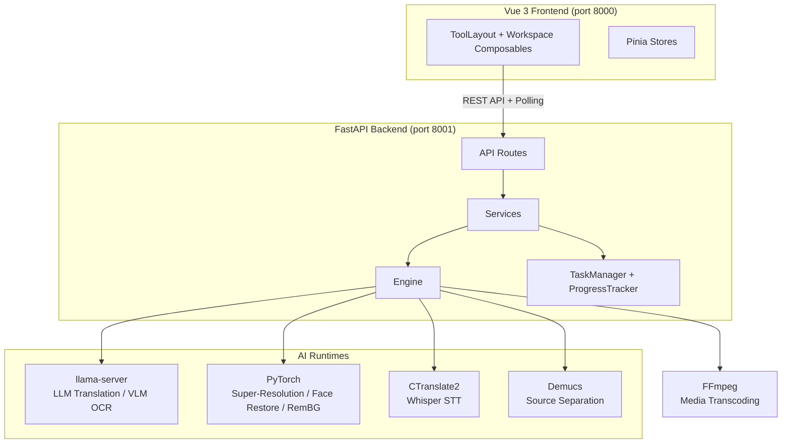

# MediaTranX Architecture

> **定位**：基於 AI 的本地多媒體處理平台，語音辨識、翻譯、圖片處理、OCR 與媒體轉檔。所有 AI 推理在本機執行。

---

## 1. 系統架構

MediaTranX 採用 **Client-Server** 架構，前後端分離：



---

## 2. 後端三層架構

```
API Routes (api/routes/)     → 參數驗證，呼叫 Service，回傳 Response
Service (services/)          → 業務邏輯，協調 FileService + TaskManager
Engine (engine/)             → AI 推理、FFmpeg、硬體偵測、路徑管理
Workers (workers/)           → TaskManager、ProgressTracker
```

**規則**：Route → Service → Engine，不可跨層。

```
backend/app/
├── main.py                          # FastAPI 入口
├── init/                            # 啟動初始化（DLL 注入、日誌、Nuitka 相容）
├── api/routes/                      # 路由層
│   ├── audio/                       # transcode, cut, volume, transcribe, separate, lyrics
│   ├── video/                       # transcode, cut, subtitle
│   ├── image/                       # convert, upscale, remove-bg, remove-object, filter, crop, ocr
│   ├── document/                    # ocr, translate, split, pdf-convert
│   ├── setup/                       # status, config, models, remote
│   └── tasks/                       # active, history
├── services/                        # 業務層（每個 route 對應一個 service）
│   ├── audio/                       # cut, lyrics, separate, transcode, transcribe, volume
│   ├── video/                       # subtitle, transcode
│   ├── image/                       # convert, crop, filter, ocr, remove_bg, remove_object, upscale
│   ├── document/                    # doc_ocr, pdf_convert, split, translate
│   ├── files/                       # file_service（上傳、暫存）
│   ├── setup/                       # ai_env, config, device, model_download, remote, ...
│   └── tasks/                       # history_service
├── engine/                          # 底層封裝
│   ├── device.py                    # GPU/CPU 偵測
│   ├── ffmpeg.py                    # FFmpeg 操作
│   ├── paths.py                     # 路徑管理（dev / frozen 雙模式）
│   └── ai/                          # AI 模型
│       ├── registry.py              # 模型註冊表
│       ├── model_manager.py         # VRAM Slot 調度
│       ├── runtime/                 # BaseRuntime, PackageRuntime, PTHRuntime, LlamaServerRuntime
│       ├── audio/                   # whisper, demucs, wav2vec2
│       ├── image/                   # realesrgan, swinir, bsrgan, real_cugan, waifu2x, codeformer, gfpgan, mobilesam
│       ├── remote/                  # ollama, openai, gemini
│       └── llama/                   # LLM prompt templates
├── workers/                         # TaskManager + ProgressTracker
├── db/                              # SQLModel（api_connection, task_history）
├── models/                          # 跨層共用型別（TaskData, FileData）
└── utils/                           # gif_utils, prompts
```

詳細規範見 [BACKEND_ARCHITECTURE.md](BACKEND_ARCHITECTURE.md)。

### AI 模型系統

| 元件 | 說明 |
|------|------|
| **Registry** | 模型定義（FORMAT × model_id × variant），Single Source of Truth |
| **Runtime** | 推理封裝：PTHRuntime、LlamaServerRuntime、PackageRuntime |
| **ModelManager** | VRAM 調度（Slot 機制），GPU session 管理 |

| FORMAT | Runtime | 用途 |
|--------|---------|------|
| `FORMAT_PKG` | PackageRuntime | Whisper（STT）、Demucs（音源分離） |
| `FORMAT_GGUF` | LlamaServerRuntime | 翻譯 LLM（Qwen3、TranslateGemma） |
| `FORMAT_PTH` | PTHRuntime | 超解析、人臉修復、去背 |
| `FORMAT_VLM` | LlamaServerRuntime | VLM OCR（Qwen3-VL、InternVL、Gemma 3） |

### 遠端 API Provider

支援雲端模型作為本地模型的替代方案：

| Provider | 用途 |
|----------|------|
| Ollama | 自建 LLM 伺服器 |
| OpenAI | GPT 翻譯 / OCR |
| Gemini | Google AI 翻譯 / OCR |

---

## 3. 前端架構

### View 結構

| View | 路由 | 功能 |
|------|------|------|
| `HomeView` | `/` | 首頁，工具卡片 + 拖曳入口 |
| `ImageView` | `/image` | 轉檔、去背、物件移除、超解析、調整、濾鏡、裁切、OCR |
| `AudioView` | `/audio` | 轉檔、剪切、音量、語音轉文字、音源分離、歌詞提取 |
| `VideoView` | `/video` | 轉檔、剪切、字幕提取與翻譯 |
| `DocumentView` | `/document` | OCR、翻譯、分割、PDF 轉換 |
| `TasksView` | `/tasks` | 執行中任務 + 歷史紀錄 |
| `SettingsView` | `/settings` | AI 環境安裝、模型管理、雲端連線、一般設定 |
| `SetupView` | `/setup` | 首次啟動安裝精靈 |

### Pinia Stores

| Store | 說明 |
|-------|------|
| `tasks` | 任務狀態（`Map<taskId, Task>`）+ Polling 同步 |
| `files` | 檔案上傳 / 本地註冊 |
| `settings` | 使用者偏好（主題、語言、路徑） |
| `models` | 本地 AI 模型狀態 |
| `remoteModels` | 雲端 API 模型列表 |

### 共用框架

- **ToolLayout**：三欄式佈局（sidebar + preview + settings），可拖曳調整寬度
- **AppFilmstrip**：底部多檔案管理列，支援 Shift+拖曳框選、Ctrl+點擊多選
- **useMediaCollection**：多檔案狀態管理 composable，跨所有工具共用
- **useSubmitTask**：任務提交（POST → store → toast）
- **ComparisonSlider**：原圖 / 結果圖 slider 比對

詳細規範見 [FRONTEND_DESIGN_SYSTEM.md](FRONTEND_DESIGN_SYSTEM.md)。

---

## 4. 任務生命週期

```
1. Submit    → 前端 POST /api/{domain}/{action}
2. Register  → TaskManager 建立任務，前端加入 TaskStore
3. Poll     → 前端每秒 GET /api/tasks 同步進度
4. Execute   → Service 透過 ModelManager 取得 GPU → 推理
5. Progress  → ProgressTracker 記錄 progress (0.0~1.0)，前端 polling 取得
6. Complete  → stage="completed" + result (output_file_id)
7. Display   → 前端更新 preview 或觸發下載
```

---

## 5. 資料路徑

所有路徑透過 `engine/paths.py` 管理：

| 目錄 | 預設路徑 | 說明 |
|------|----------|------|
| Models | `%APPDATA%/MediaTranX/models/` | AI 模型權重 |
| Venv | `%APPDATA%/MediaTranX/.venv/` | AI 推理環境（uv 管理） |
| Temp | `%APPDATA%/MediaTranX/temp/` | 處理暫存檔 |
| Logs | `%APPDATA%/MediaTranX/logs/` | 應用日誌 |
| DB | `backend/mediatranx.db` | SQLite（連線設定、任務歷史） |

---

## 6. API 端點總覽

| 方法 | 端點 | 說明 |
|------|------|------|
| **系統與設定** | | |
| GET | `/api/health` | 健康檢查 |
| GET | `/api/device` | GPU/CPU 裝置資訊 |
| GET | `/api/setup/status` | AI 環境狀態 |
| POST | `/api/setup/initialize` | 啟動 AI 環境安裝 |
| GET/POST | `/api/setup/config` | 應用設定 |
| GET | `/api/setup/models` | 模型列表 |
| POST | `/api/setup/models/download` | 下載模型 |
| POST | `/api/setup/models/remove` | 移除模型 |
| GET/POST | `/api/setup/remote/connections` | 雲端 API 連線管理 |
| GET | `/api/setup/remote/models` | 雲端模型列表 |
| **檔案** | | |
| POST | `/api/files/upload` | 上傳檔案 |
| GET | `/api/files/{id}/download` | 下載檔案 |
| POST | `/api/files/cleanup` | 清理暫存 |
| **任務** | | |
| GET | `/api/tasks` | 進行中任務 |
| GET | `/api/tasks/{id}` | 任務詳情 |
| POST | `/api/tasks/{id}/cancel` | 取消任務 |
| GET | `/api/tasks/history` | 歷史紀錄 |
| **影片** | | |
| GET | `/api/video/info/{file_id}` | 媒體資訊 |
| POST | `/api/video/transcode` | 轉檔 |
| POST | `/api/video/cut` | 剪切 |
| POST | `/api/video/extract-audio` | 提取音軌 |
| POST | `/api/video/subtitle/generate` | 字幕提取（Whisper） |
| **音訊** | | |
| GET | `/api/audio/info/{file_id}` | 媒體資訊 |
| POST | `/api/audio/transcode` | 轉檔 |
| POST | `/api/audio/cut` | 剪切 |
| POST | `/api/audio/volume` | 音量調整 |
| POST | `/api/audio/transcribe` | 語音轉文字 |
| POST | `/api/audio/separate` | 音源分離（Demucs） |
| POST | `/api/audio/lyrics` | 歌詞提取 |
| **圖片** | | |
| GET | `/api/image/info/{file_id}` | 圖片資訊 |
| POST | `/api/image/convert` | 格式轉換 |
| POST | `/api/image/upscale` | 超解析 |
| POST | `/api/image/remove-bg` | 去背 |
| POST | `/api/image/remove-object` | 物件移除（SAM + LaMa） |
| POST | `/api/image/filter` | 濾鏡 |
| POST | `/api/image/crop` | 裁切 |
| POST | `/api/image/ocr` | 文字辨識（VLM） |
| **文件** | | |
| POST | `/api/document/ocr` | 文字辨識（VLM） |
| POST | `/api/document/translate` | 翻譯 |
| POST | `/api/document/split` | 分割 |
| POST | `/api/document/pdf-convert` | PDF 轉換 |

---

## 7. 開發環境

### 需求

- Node.js 18+
- Python 3.12（透過 [uv](https://docs.astral.sh/uv/) 管理）
- NVIDIA GPU + CUDA（建議 6GB+ VRAM），CPU 亦可運行

### 啟動

```bash
# Frontend (port 8000)
cd frontend
npm install
npm run dev

# Backend (port 8001)
cd backend
uv sync
uv run uvicorn app.main:app --host 127.0.0.1 --port 8001
```

### AI 環境

首次啟動後在 Settings 頁面安裝 AI 推理環境：
1. **工具執行模組**：`uv sync --extra ai`（Whisper、Demucs、HuggingFace 等）
2. **深度學習推理模組**：PyTorch（自動偵測 CUDA / CPU）
3. **語言推理模組**：llama-server 二進位
