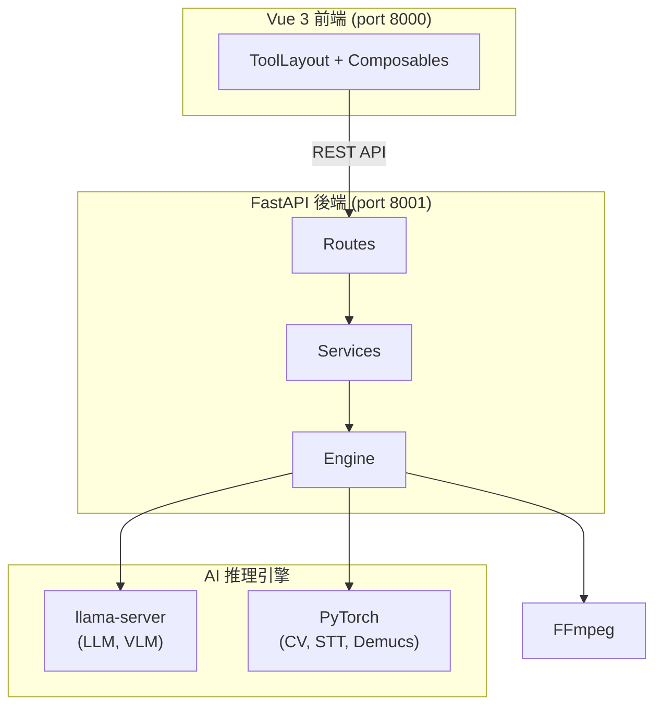

# MediaTranX

[](../LICENSE)
[](https://github.com/sw-willie-wu/MediaTranX/stargazers)
[](https://github.com/sw-willie-wu/MediaTranX/releases)

**基於 AI 的本地多媒體處理工具** — 語音辨識、翻譯、超解析、OCR 與格式轉換。所有 AI 推理在你的電腦上本地執行。

[English](../README.md)

<!-- 在這裡加截圖 -->
<!--  -->

---

## 功能

### 圖片工具
- 格式轉換（PNG、JPEG、WebP、BMP、TIFF、GIF、ICO）
- AI 超解析（Real-ESRGAN、SwinIR、BSRGAN、Real-CUGAN、Waifu2x）
- AI 去背（rembg）
- AI 物件移除（MobileSAM + LaMa 修補）
- 人臉修復（CodeFormer、GFPGAN）
- OCR 文字辨識（視覺語言模型）
- 調整、濾鏡、裁切

### 音訊工具
- 格式轉碼（MP3、WAV、FLAC、OGG、AAC、M4A、WMA、OPUS）
- 剪切、音量調整
- AI 語音轉文字（Faster-Whisper）+ 摘要
- AI 音源分離（Demucs 6 軌）
- AI 歌詞提取 + 精準對齊
- 透過本地 LLM 或雲端 API 翻譯

### 影片工具
- 格式轉碼（MP4、MKV、AVI、MOV、WebM 等）
- 剪切（Stream Copy）
- AI 字幕提取（Whisper）
- AI 字幕翻譯

### 文件工具
- OCR 文字辨識（視覺語言模型）
- AI 翻譯
- PDF 分割、PDF 轉換

### 通用功能
- 多檔案批次處理 + Filmstrip 管理介面
- 深色 / 淺色主題，Glassmorphism 設計風格
- 即時任務進度追蹤
- 本地 + 雲端 AI 模型支援（Ollama、OpenAI、Gemini）
- 多語系：繁體中文、英文

---

## AI 模型

| 類別 | 模型 |
|------|------|
| **語音辨識** | Faster-Whisper（tiny / base / small / medium / large-v3） |
| **翻譯 LLM** | TranslateGemma（4B/12B/27B）、Qwen3（1.7B/4B/8B/14B） |
| **超解析** | Real-ESRGAN、SwinIR、BSRGAN、Real-CUGAN、Waifu2x |
| **人臉修復** | CodeFormer、GFPGAN v1.4 |
| **VLM（OCR）** | Qwen3-VL（2B/4B/8B）、InternVL2.5（1B/4B）、Gemma 3（4B/12B） |
| **音源分離** | Demucs HTDemucs 6 軌 |
| **精準對齊** | Wav2Vec2（16 種語言） |
| **物件分割** | MobileSAM |

模型透過內建的模型管理器按需下載。

---

## 技術架構

```
前端：Vue 3 + TypeScript + Pinia + Vite
後端：FastAPI + Python 3.12 + uv
AI：  PyTorch / CTranslate2 / llama-server
媒體：FFmpeg
```

---

## 架構概覽



詳見 [ARCHITECTURE.md](ARCHITECTURE.md)。

---

## 快速開始

### 環境需求

- **Node.js** 18+
- **Python** 3.12（透過 [uv](https://docs.astral.sh/uv/) 管理）
- **NVIDIA GPU** + CUDA（建議 6GB+ VRAM），也支援 CPU 模式

### 安裝

```bash
git clone https://github.com/sw-willie-wu/MediaTranX.git
cd MediaTranX

# 前端
cd frontend
npm install

# 後端
cd ../backend
uv sync
```

### 啟動

```bash
# 終端 1：前端（port 8000）
cd frontend
npm run dev

# 終端 2：後端（port 8001）
cd backend
uv run uvicorn app.main:app --host 127.0.0.1 --port 8001
```

開啟瀏覽器 `http://localhost:8000`。

### 安裝 AI 環境

首次啟動後，到 **設定 > AI 環境** 點擊 **安裝核心模組**：
1. 工具執行模組（Whisper、Demucs、HuggingFace 等）
2. 深度學習推理模組（PyTorch — 自動偵測 CUDA / CPU）
3. 語言推理模組（llama-server）

安裝完成後到 **設定 > 模型與工具** 下載所需模型。

---

## 文件

- [架構文件](ARCHITECTURE.md) — 系統概覽、API 端點、資料流
- [後端開發規範](BACKEND_ARCHITECTURE.md) — 後端開發規則
- [前端設計系統](FRONTEND_DESIGN_SYSTEM.md) — UI/UX 規範

---

## 授權

MIT
