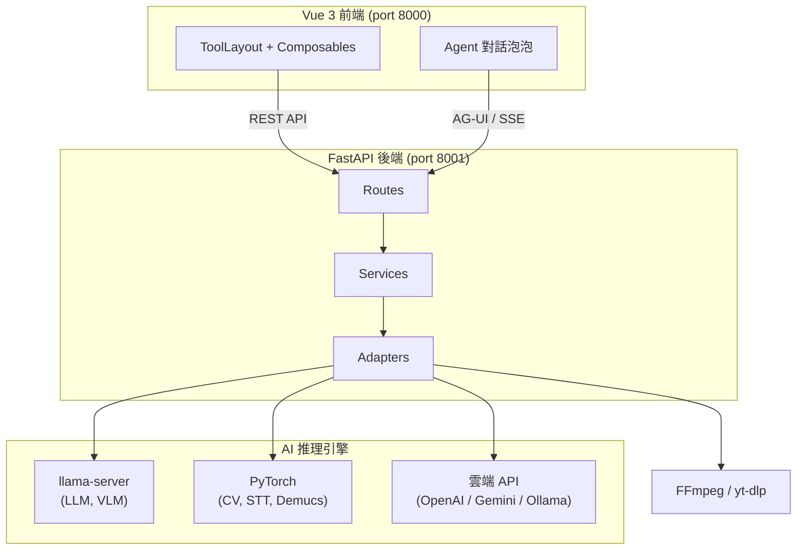

<p align="center">
  
</p>

<h1 align="center">MediaTranX — AI 本地多媒體處理工具</h1>

<p align="center">
<a href="https://github.com/sw-willie-wu/MediaTranX/releases"></a>
<a href="../LICENSE"></a>
<a href="https://github.com/sw-willie-wu/MediaTranX/releases"></a>
<a href="https://github.com/sw-willie-wu/MediaTranX/stargazers"></a>
</p>

<p align="center">
<a href="https://www.electronjs.org/"></a>
<a href="https://vuejs.org/"></a>
<a href="https://www.python.org/"></a>
<a href="https://pytorch.org/"></a>
</p>

免費開源桌面應用，提供 **AI 語音辨識、AI 翻譯、AI 圖片超解析、AI 文字辨識 (OCR)、音源分離、影片摘要、媒體轉檔** — 可用自然語言對話操作，也可用傳統工具介面，所有 AI 推理預設完全在**本地**執行，不上傳雲端，無需訂閱，完全隱私。雲端供應商（OpenAI / Gemini / Ollama）為選用。

[English](../README.md)

[](https://youtu.be/r5vivvL1Nds)

---

## 主要功能

### 🤖 AI 助理（自然語言）
- **對話式操作** — 用白話描述需求（例如「把這個轉成 1080p MP4」、「辨識並翻譯成英文」），內建 Agent 就會自動幫你操作工具：切到正確的工具、選功能、載入檔案、填參數、執行任務 — 並在實際執行前先讓你確認。
- **跨所有領域** — 圖片、音訊、影片、文件工具都能驅動。
- **本地或雲端** — 可用本地 LLM（Qwen3、Gemma）或雲端模型（OpenAI、Gemini、Ollama）。
- **多對話紀錄** — 對話會被保存、可隨時接續。

### 🖼️ 圖片處理
- **AI 超解析** — 使用 Real-ESRGAN、SwinIR、BSRGAN、Real-CUGAN、Waifu2x 放大圖片 2x–4x，並可選擇開啟 **AI 人臉修復（GFPGAN）**。
- **AI 去背** — 使用 rembg（U²-Net / ISNet）自動去除背景，支援 自動 / 人物 / 商品 / 動物 / 動漫 模式。
- **AI 物件移除** — 用筆刷、多邊形或貝茲曲線選取物件，以 MobileSAM 分割 + LaMa 修補移除。
- **AI 文字辨識 (OCR)** — 使用視覺語言模型（Qwen3-VL、InternVL2.5、Gemma）提取圖片文字 — 可本地或雲端。
- **格式轉換** — PNG、JPEG、WebP、BMP、TIFF、GIF、ICO。
- **圖片編輯** — 調整（亮度/對比/飽和度/色相/銳利度）、濾鏡、裁切 — 即時預覽。

### 🎵 音訊處理
- **AI 語音轉文字** — 使用 Faster-Whisper（tiny → large-v3）轉錄語音，可選擇人聲分離、翻譯與逐字對齊。
- **AI 音源分離** — 使用 Demucs 6 軌分離人聲、鼓、貝斯、吉他、鋼琴、其他，並可選擇 **音訊 → MIDI** 轉換（Basic Pitch）。
- **AI 歌詞提取** — 使用 Wav2Vec2 強制對齊辨識並對齊歌詞（多語言）。
- **AI 翻譯** — 透過本地 LLM（Qwen3、Gemma）或雲端 API（OpenAI、Gemini、Ollama）翻譯字幕／歌詞。
- **MIDI 編輯器** — 完整鋼琴捲軸編輯器，支援 Tone.js 即時播放、GM 音色、逐音符力度、速度／拍號、效果器、音訊匯出。
- **格式轉碼** — MP3、AAC、OGG、M4A、Opus、FLAC、ALAC、WAV、AIFF。
- **音訊編輯** — 剪切、音量調整。

### 🎬 影片處理
- **AI 字幕提取** — 使用 Whisper 自動產生字幕，可選擇翻譯與逐字對齊。
- **AI 影片摘要** — 產生附代表性關鍵影格的 Markdown 摘要（重點條列或敘事模式）。結合 Whisper 轉錄、LLM 摘要、場景偵測與選用的 **VLM 取幀**；輸出為 ZIP（摘要 + 關鍵影格）。
- **貼網址下載** — 貼上影片連結，透過 yt-dlp 下載（自動最佳／限制解析度／指定格式），下載完直接進入編輯。
- **AI 補幀** — 使用 RIFE 提升影片幀率（2x / 4x / 自訂）。
- **AI 畫面強化** — 使用 Real-ESRGAN / SwinIR 提升影片解析度。
- **格式轉碼** — MP4、MKV、AVI、MOV、WebM，支援編碼控制（H.264 / H.265 / VP9）。
- **影片編輯** — Stream Copy 剪切、畫面裁切、音訊提取。

### 📄 文件處理
- **AI 文字辨識 (OCR)** — 使用視覺語言模型從文件和 PDF 提取文字 — 可本地或雲端。
- **AI 翻譯** — 透過本地 LLM 或雲端 API 翻譯文件。
- **PDF 工具** — 依頁分割、轉換為純文字 / Markdown / 頁面圖片。

### ⚙️ 通用功能
- **多檔案批次處理**，Filmstrip 管理介面（同一操作套用到多個檔案）。
- **產出抽屜** — 從標題列瀏覽所有任務產出，並可將任一產物直接帶入對應工具繼續處理。
- **貼上加入檔案** — 從剪貼簿或檔案總管 `Ctrl+V` 貼入圖片或檔案。
- **前後對比滑桿** — 圖片與影片成果的 before / after 比較。
- **深色 / 淺色主題**，Glassmorphism 設計風格。
- **即時任務進度**追蹤，支援取消。
- **本地 + 雲端 AI** 模型支援 — 預設本地推理；OpenAI / Gemini / Ollama 連線為選用，於設定中管理。
- **多語系介面** — 繁體中文、英文。
- **預設 100% 本地推理** — 除非你選用雲端模型，否則資料不離開你的電腦。

---

## 支援的 AI 模型

| 類別 | 模型 |
|------|------|
| **語音辨識** | Faster-Whisper（tiny / base / small / medium / large-v3） |
| **對話／翻譯／摘要 LLM** | Qwen3、Qwen3.5、Gemma 3、Gemma 4（多種尺寸）— 本地 GGUF 或雲端 |
| **視覺語言模型（OCR／取幀）** | Qwen3-VL、InternVL2.5、Gemma（多種尺寸）— 本地 GGUF 或雲端 |
| **圖片超解析** | Real-ESRGAN、SwinIR、BSRGAN、Real-CUGAN、Waifu2x |
| **人臉修復** | GFPGAN v1.4 |
| **物件移除** | MobileSAM（分割）+ LaMa（修補） |
| **背景去除** | rembg — U²-Net / ISNet |
| **音源分離** | Demucs HTDemucs 6 軌 |
| **音訊 → MIDI** | Basic Pitch |
| **強制對齊** | Wav2Vec2（多語言） |
| **影片補幀** | RIFE v4.26 |
| **雲端供應商** | OpenAI、Google Gemini、Ollama（選用） |

所有本地模型透過內建的模型管理器按需下載，無需手動設定。

---

## 技術架構

| 層級 | 技術 |
|------|------|
| 桌面殼層 | Electron 34 |
| 前端 | Vue 3 + TypeScript + Pinia + Vite |
| 後端 | FastAPI + Python 3.12 + uv |
| AI 推理 | PyTorch、CTranslate2、llama-server (GGUF) |
| Agent 協定 | AG-UI（SSE 串流工具呼叫） |
| 媒體 | FFmpeg、yt-dlp、Tone.js |

---

## 架構概覽



詳見[架構文件](ARCHITECTURE.md)。

---

## 快速開始

> 一般使用者直接到 [Releases](https://github.com/sw-willie-wu/MediaTranX/releases) 頁面下載安裝檔即可。以下是從原始碼執行的說明。

### 環境需求

- **Node.js** 18+
- **Python** 3.12（透過 [uv](https://docs.astral.sh/uv/) 管理）
- **NVIDIA GPU** + CUDA（建議 6GB+ VRAM），也支援 CPU 模式

### 安裝

```bash
git clone https://github.com/sw-willie-wu/MediaTranX.git
cd MediaTranX

# 後端
cd backend
uv sync

# 前端
cd ../frontend
npm install
```

### 啟動

```bash
# 終端 1：後端（port 8001）
cd backend
uv run python -m app.main --mode dev --port 8001

# 終端 2：前端（port 8000）
cd frontend
npm run dev
```

開啟瀏覽器 `http://localhost:8000`。

### 下載 AI 模型

啟動後，到 **設定 > AI 模型** 下載所需模型。若要使用雲端供應商，在同一畫面新增連線（API key／端點）即可。

---

## 文件

- [架構文件](ARCHITECTURE.md) — 系統概覽、API 端點、資料流
- [後端開發規範](BACKEND_DEVELOP_SPEC.md) — 後端開發規則
- [前端開發規範](FRONTEND_DEVELOP_SPEC.md) — UI/UX 規範

---

## 授權

MIT — 詳見 [LICENSE](../LICENSE)。
