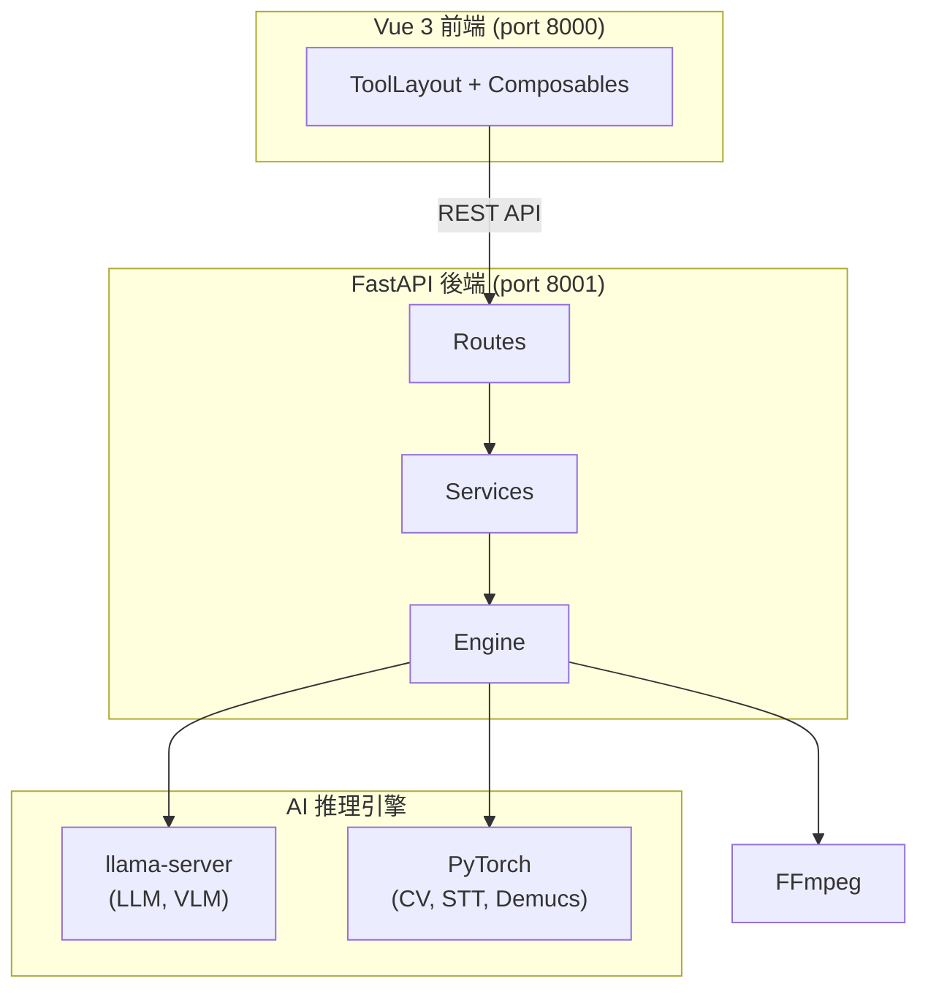

# MediaTranX — AI 本地多媒體處理工具

[](https://github.com/sw-willie-wu/MediaTranX/releases)
[](../LICENSE)
[](https://github.com/sw-willie-wu/MediaTranX/releases)
[](https://github.com/sw-willie-wu/MediaTranX/stargazers)

[](https://www.electronjs.org/)
[](https://vuejs.org/)
[](https://www.python.org/)
[](https://pytorch.org/)

免費開源桌面應用，提供 **AI 語音辨識、AI 翻譯、AI 圖片超解析、AI 文字辨識 (OCR)、音源分離、媒體轉檔** — 所有 AI 推理完全在本地執行，不上傳雲端，無需訂閱，完全隱私。

[English](../README.md)

[](https://youtu.be/r5vivvL1Nds)

---

## 主要功能

### 圖片處理
- **AI 超解析** — 使用 Real-ESRGAN、SwinIR、BSRGAN、Real-CUGAN、Waifu2x 放大圖片 2x-4x
- **AI 去背** — 使用 rembg 自動去除背景
- **AI 物件移除** — 使用 MobileSAM 選取 + LaMa 修補移除物件
- **AI 人臉修復** — 使用 CodeFormer、GFPGAN 修復人臉
- **AI 文字辨識 (OCR)** — 使用視覺語言模型（Qwen3-VL、InternVL、Gemma 3）提取圖片文字
- **格式轉換** — PNG、JPEG、WebP、BMP、TIFF、GIF、ICO
- **圖片編輯** — 調整、濾鏡、裁切

### 音訊處理
- **AI 語音轉文字** — 使用 Faster-Whisper（tiny 到 large-v3）轉錄語音 + 自動摘要
- **AI 音源分離** — 使用 Demucs 6 軌分離人聲、鼓、貝斯、吉他、鋼琴、其他
- **AI 歌詞提取** — 使用 Wav2Vec2 精準對齊歌詞（支援 16 種語言）
- **AI 翻譯** — 透過本地 LLM（Qwen3、TranslateGemma）或雲端 API（OpenAI、Gemini）翻譯
- **MIDI 編輯器** — 鋼琴捲軸編輯器，支援 Tone.js 即時播放、GM 音色、效果器、音訊匯出
- **格式轉碼** — MP3、WAV、FLAC、OGG、AAC、M4A、WMA、OPUS
- **音訊編輯** — 剪切、音量調整

### 影片處理
- **AI 字幕提取** — 使用 Whisper 語音辨識自動產生字幕
- **AI 字幕翻譯** — 透過本地 LLM 或雲端 API 翻譯字幕
- **AI 補幀** — 使用 RIFE 提升影片幀率（2x/4x/自訂）
- **AI 畫面強化** — 使用 Real-ESRGAN 提升影片解析度
- **格式轉碼** — MP4、MKV、AVI、MOV、WebM，支援編碼控制（H.264/H.265/VP9/AV1）
- **影片編輯** — Stream Copy 剪切、音訊提取

### 文件處理
- **AI 文字辨識 (OCR)** — 使用視覺語言模型從文件和 PDF 提取文字
- **AI 翻譯** — 透過本地 LLM 或雲端 API 翻譯文件
- **PDF 工具** — 分割、轉換

### 通用功能
- **多檔案批次處理**，Filmstrip 管理介面
- **深色 / 淺色主題**，Glassmorphism 設計風格
- **即時任務進度**追蹤
- **本地 + 雲端 AI** 模型支援（Ollama、OpenAI、Gemini）
- **多語系介面** — 繁體中文、英文
- **100% 本地推理** — 資料不離開你的電腦

---

## 支援的 AI 模型

| 類別 | 模型 |
|------|------|
| **語音辨識** | Faster-Whisper（tiny / base / small / medium / large-v3） |
| **翻譯 LLM** | TranslateGemma（4B/12B/27B）、Qwen3（1.7B/4B/8B/14B） |
| **圖片超解析** | Real-ESRGAN、SwinIR、BSRGAN、Real-CUGAN、Waifu2x |
| **人臉修復** | CodeFormer、GFPGAN v1.4 |
| **視覺語言模型（OCR）** | Qwen3-VL（2B/4B/8B）、InternVL2.5（1B/4B）、Gemma 3（4B/12B） |
| **音源分離** | Demucs HTDemucs 6 軌 |
| **精準對齊** | Wav2Vec2（16 種語言） |
| **影片補幀** | RIFE v4.26 |
| **物件分割** | MobileSAM |

所有模型透過內建的模型管理器按需下載，無需手動設定。

---

## 技術架構

| 層級 | 技術 |
|------|------|
| 桌面殼層 | Electron 34 |
| 前端 | Vue 3 + TypeScript + Pinia + Vite |
| 後端 | FastAPI + Python 3.12 + uv |
| AI 推理 | PyTorch、CTranslate2、llama-server (GGUF) |
| 媒體 | FFmpeg、Tone.js |

---

## 架構概覽



詳見[架構文件](ARCHITECTURE.md)。

---

## 快速開始

### 環境需求

- **Node.js** 18+
- **Python** 3.12（透過 [uv](https://docs.astral.sh/uv/) 管理）
- **NVIDIA GPU** + CUDA（建議 6GB+ VRAM），也支援 CPU 模式

### 安裝

```bash
git clone https://github.com/sw-willie-wu/MediaTranX.git
cd MediaTranX

# 後端
cd backend
uv sync

# 前端
cd ../frontend
npm install
```

### 啟動

```bash
# 終端 1：後端（port 8001）
cd backend
uv run python -m app.main --mode dev --port 8001

# 終端 2：前端（port 8000）
cd frontend
npm run dev
```

開啟瀏覽器 `http://localhost:8000`。

### 下載 AI 模型

啟動後，到 **設定 > AI 模型** 下載所需模型。

---

## 文件

- [架構文件](ARCHITECTURE.md) — 系統概覽、API 端點、資料流
- [後端開發規範](BACKEND_DEVELOP_SPEC.md) — 後端開發規則
- [前端開發規範](FRONTEND_DEVELOP_SPEC.md) — UI/UX 規範

---

## 授權

MIT — 詳見 [LICENSE](../LICENSE)。
